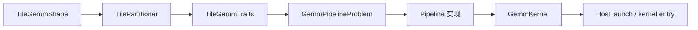

# Composable Kernel（CK）编程模型：ck_tile GEMM 视角

本文档描述 **ck_tile** 路径下 GEMM 相关 kernel 的分层抽象与数据流。ck_tile 是面向 tile 化编程的高层 API，与早期 `ck::tensor_operation::device::DeviceGemm*` 一类 **device 层** 模板在命名与组合方式上不同；新算子与调优应优先对齐 `include/ck_tile/` 下的类型与 pipeline。

## 从问题到 launch 的类型链

在典型 GEMM 路径中，类型与组件按以下顺序组合（名称以仓库中惯例为准，具体模板参数因精度与布局而异）：



| 阶段 | 作用 |
|------|------|
| `TileGemmShape` | 描述 block / warp 级 tile 在 M、N、K 上的静态形状与存储粒度（如 K 按 element 还是按「storage」块计）。 |
| `TilePartitioner` | 将全局 M×N 输出域划分为 thread block 负责的 tile，并决定 grid 维度的语义（1D / 2D / 空间局部）。 |
| `TileGemmTraits` | 汇总布局、数据类型、MFMA 与访存特征，供 pipeline 与 epilogue 选择。 |
| `GemmPipelineProblem` | 把 A/B/C 张量描述、stride、pipeline 策略绑成「可执行问题」。 |
| `Pipeline` | block 内 **global → LDS（可选 ping-pong）→ 寄存器 → MFMA** 的流水实现。 |
| `GemmKernel` | 将 pipeline 与 epilogue 封装为 device 函数，供 host 侧 launch。 |

理解这条链有助于：**改 tile 只动 Shape/Traits**，**换流水只换 Pipeline 模板**，**改并行方式只换 Partitioner 或 scheduler 策略**。

## 三级协作关系（与源码目录对应）

### 第一级：TilePartitioner（workgroup 级划分）

决定每个 thread block 对应输出 tile 的坐标与 grid 形状。

| 类型 | 语义 |
|------|------|
| `GemmTile2DPartitioner` | 经典 **2D grid**：`(M_blocks, N_blocks)`，与行主/列主块遍历直观对应。 |
| `GemmTile1DPartitioner` | **1D 线性化** 块索引，便于与 persistent / 动态调度或单一维度的负载均衡结合。 |
| `GemmSpatiallyLocalTilePartitioner` | **空间局部** 分组：在 multi-die / 多 XCD 场景（如 **gfx94x**）下，通过 **RemapXCD** 等机制让相邻 block 更可能命中本地缓存层次，减轻跨 die 流量。 |

### 第二级：Scheduler 策略（K 维与 wave 组织）

同一套 pipeline 上，常见调度变体包括（命名因头文件而异，语义如下）：

| 策略 | 行为要点 | 典型搭配 |
|------|-----------|----------|
| **Default** | 标准 **K-loop**：按 K tile 迭代，预取与计算交替。 | 通用 baseline。 |
| **Intrawave** | 在 **同一 wave** 内组织 K 迭代与预取；compute 类 pipeline 上常为默认。 | `COMPUTE_V3` 等。 |
| **Interwave** | **跨 wave** 组织阶段；memory pipeline 上可出现 **单段大 K 序列 per stage**，以适配带宽与预取深度。 | `MEMORY` pipeline、`PrefetchStages` 与 **MinMemInFlyBytes** 等参数联动。 |

与部分文档中「Static / Persistent / Dynamic」等 **device 层** 调度命名并存；在 **ck_tile GEMM** 调优与阅读 `ops/gemm/pipeline/` 时，以 **Intrawave / Interwave** 与具体 pipeline 注释为准。

### 第三级：TilePipeline（block 内数据流）

位于 `include/ck_tile/ops/gemm/pipeline/`，负责 LDS 分配、预取段数、双缓冲与 MFMA 提交顺序。详见 [[ck-tile-tuning.md|ck-tile-tuning]] 中的 pipeline 类型表。

## Pipeline 类型一览（GEMM）

下列实现类名来自 `include/ck_tile/ops/gemm/pipeline/` 中的命名习惯；**枚举标签**（如 `MEMORY`、`COMPUTE_V3`）便于在配置与文档中对应。

| Pipeline 标签 | 典型实现类 | 特征摘要 |
|----------------|------------|----------|
| `MEMORY` | `GemmPipelineAgBgCrMem` | **访存主导**；`MinMemInFlyBytes` 常与 **32768** 量级相关；`PrefetchStages` 常见 **2–8**；支持 **Intrawave / Interwave**。 |
| `COMPUTE_V3` | `GemmPipelineAgBgCrCompV3` | `PrefetchStages=2`；**仅 Intrawave**。 |
| `COMPUTE_V4` | `GemmPipelineAgBgCrCompV4` | **双份 SMEM（LDS ping-pong）**，隐藏访存延迟。 |
| `COMPUTE_V5` | `GemmPipelineAgBgCrCompV5` | `NumWaveGroups=2`，wave 组织与占用相关。 |
| `COMPUTE_V6` | `GemmPipelineAgBgCrCompV6` | **K tile 固定为 32**（特定微架构/指令约束下的简化路径）。 |
| `COMPUTE_ASYNC` | `GemmPipelineAgBgCrCompAsync` | **大 `K_Warp_Tile`（如 128）**、双 SMEM、面向 **FP4** 等路径的异步流水。 |
| `PRESHUFFLE_V2` | `WeightPreshufflePipelineAGmemBGmemCRegV2` | **推理权重 preshuffle**：权重预先按消费顺序重排，降低 decode 路径开销。 |

## 与早期 Device API 的类比

若你熟悉下列「老」写法，可按下表映射到 ck_tile 心智模型：

```cpp
// 示意：device 层组合（具体模板名以仓库为准）
// using Problem = ck::tensor_operation::device::DeviceGemmXdl<...>;
// Problem{}.Run(args, stream);

// ck_tile：先固定 TileGemmShape + Partitioner + Traits，
// 再选 GemmPipelineProblem + 具体 Pipeline + GemmKernel，最后 launch。
```

| 老概念 | ck_tile 中的对应物 |
|--------|-------------------|
| `TileConfig<BlockM, BlockN, ...>` | `TileGemmShape` + warp tile + pipeline 的静态参数 |
| block grid 划分 | `GemmTile2DPartitioner` / `1D` / `SpatiallyLocal` |
| pipeline depth | 具体 pipeline 的 `PrefetchStages`、双 SMEM、async 等 |
| epilogue 融合 | `TileGemmTraits` + epilogue 模板（视算子而定） |

## 扩展与融合 kernel 的实践顺序

1. **在 `include/ck_tile/` 中检索**已有 **GEMM / reduction / epilogue** 原语，确认是否已有相同数据路径。
2. **选定 pipeline**（memory vs compute vs preshuffle），使瓶颈与硬件行为一致（带宽 vs 算力 vs 权重布局）。
3. **在新 pipeline 中拼接**子阶段，融合点尽量 **register / LDS 直达**，避免中间写 global。
4. **为融合算子单独调优** `TileGemmShape` 与 scheduler（Intrawave vs Interwave），必要时对比 `GemmTile2DPartitioner` 与 `GemmSpatiallyLocalTilePartitioner` 在多 die 上的表现。

## 相关文档

- 具体 block/warp tile 与预设配置名：[[ck-tile-tuning.md|ck-tile-tuning]]
- AMD 推理侧算子封装与落地：[[aiter-ops-reference.md|aiter-ops-reference]]
