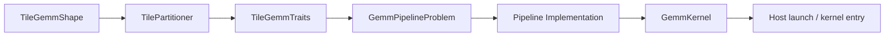

# Composable Kernel (CK) Programming Model: ck_tile GEMM Perspective

This document describes the layered abstractions and data flow for GEMM-related kernels under the **ck_tile** path. ck_tile is a high-level API oriented toward tile-based programming, differing in naming and composition from the earlier **device layer** templates such as `ck::tensor_operation::device::DeviceGemm*`; new operators and tuning should preferably align with the types and pipelines under `include/ck_tile/`.

## Type Chain from Problem to Launch

In a typical GEMM path, types and components are composed in the following order (names follow repository conventions; specific template parameters vary by precision and layout):



| Stage | Purpose |
|-------|---------|
| `TileGemmShape` | Describes the static shape and storage granularity at the block / warp level along M, N, K (e.g., whether K is counted per element or per "storage" block). |
| `TilePartitioner` | Partitions the global M x N output domain into tiles assigned to thread blocks, and determines the semantic of grid dimensions (1D / 2D / spatially local). |
| `TileGemmTraits` | Summarizes layout, data types, MFMA and memory access characteristics, for pipeline and epilogue selection. |
| `GemmPipelineProblem` | Binds A/B/C tensor descriptions, strides, and pipeline strategies into an "executable problem". |
| `Pipeline` | The in-block pipelined implementation of **global -> LDS (optional ping-pong) -> registers -> MFMA**. |
| `GemmKernel` | Wraps the pipeline and epilogue into a device function for host-side launch. |

Understanding this chain helps: **changing tiles only requires modifying Shape/Traits**, **swapping pipelines only requires changing the Pipeline template**, **changing parallelism only requires swapping the Partitioner or scheduler strategy**.

## Three-Level Cooperation (Mapped to Source Code Directories)

### Level 1: TilePartitioner (Workgroup-Level Partitioning)

Determines the output tile coordinates and grid shape for each thread block.

| Type | Semantics |
|------|-----------|
| `GemmTile2DPartitioner` | Classic **2D grid**: `(M_blocks, N_blocks)`, intuitively maps to row-major/column-major block traversal. |
| `GemmTile1DPartitioner` | **1D linearized** block index, convenient for combining with persistent / dynamic scheduling or single-dimension load balancing. |
| `GemmSpatiallyLocalTilePartitioner` | **Spatially local** grouping: in multi-die / multi-XCD scenarios (e.g., **gfx94x**), uses mechanisms like **RemapXCD** to make adjacent blocks more likely to hit local cache levels, reducing cross-die traffic. |

### Level 2: Scheduler Strategies (K-Dimension & Wave Organization)

On the same pipeline, common scheduling variants include (naming varies by header file; semantics as follows):

| Strategy | Key Behavior | Typical Pairing |
|----------|-------------|-----------------|
| **Default** | Standard **K-loop**: iterates over K tiles, alternating prefetch and compute. | General baseline. |
| **Intrawave** | Organizes K iterations and prefetching within **the same wave**; often the default on compute-class pipelines. | `COMPUTE_V3`, etc. |
| **Interwave** | Organizes stages **across waves**; on memory pipelines, may feature **single large K sequences per stage**, adapted to bandwidth and prefetch depth. | `MEMORY` pipeline, linked with `PrefetchStages` and **MinMemInFlyBytes** parameters. |

These coexist with naming like "Static / Persistent / Dynamic" from some **device layer** scheduling documentation; when tuning and reading `ops/gemm/pipeline/` in **ck_tile GEMM**, follow **Intrawave / Interwave** and specific pipeline comments as the source of truth.

### Level 3: TilePipeline (In-Block Data Flow)

Located at `include/ck_tile/ops/gemm/pipeline/`, responsible for LDS allocation, prefetch stage count, double-buffering, and MFMA submission order. See the pipeline type table in [[ck-tile-tuning.md|ck-tile-tuning]] for details.

## Pipeline Type Overview (GEMM)

The implementation class names below come from the naming conventions in `include/ck_tile/ops/gemm/pipeline/`; **enum tags** (e.g., `MEMORY`, `COMPUTE_V3`) are used for mapping in configurations and documentation.

| Pipeline Tag | Typical Implementation Class | Feature Summary |
|--------------|------------------------------|-----------------|
| `MEMORY` | `GemmPipelineAgBgCrMem` | **Memory-dominated**; `MinMemInFlyBytes` commonly on the order of **32768**; `PrefetchStages` typically **2-8**; supports **Intrawave / Interwave**. |
| `COMPUTE_V3` | `GemmPipelineAgBgCrCompV3` | `PrefetchStages=2`; **Intrawave only**. |
| `COMPUTE_V4` | `GemmPipelineAgBgCrCompV4` | **Dual SMEM (LDS ping-pong)**, hides memory access latency. |
| `COMPUTE_V5` | `GemmPipelineAgBgCrCompV5` | `NumWaveGroups=2`, wave organization related to occupancy. |
| `COMPUTE_V6` | `GemmPipelineAgBgCrCompV6` | **K tile fixed at 32** (simplified path under specific microarchitecture/instruction constraints). |
| `COMPUTE_ASYNC` | `GemmPipelineAgBgCrCompAsync` | **Large `K_Warp_Tile` (e.g., 128)**, dual SMEM, asynchronous pipeline targeting **FP4** and similar paths. |
| `PRESHUFFLE_V2` | `WeightPreshufflePipelineAGmemBGmemCRegV2` | **Inference weight preshuffle**: weights pre-rearranged in consumption order, reducing decode path overhead. |

## Analogy to the Earlier Device API

If you are familiar with the following "old" style, you can map to the ck_tile mental model using the table below:

```cpp
// Illustration: device layer composition (specific template names per repository)
// using Problem = ck::tensor_operation::device::DeviceGemmXdl<...>;
// Problem{}.Run(args, stream);

// ck_tile: first fix TileGemmShape + Partitioner + Traits,
// then select GemmPipelineProblem + specific Pipeline + GemmKernel, finally launch.
```

| Old Concept | ck_tile Counterpart |
|-------------|---------------------|
| `TileConfig<BlockM, BlockN, ...>` | `TileGemmShape` + warp tile + pipeline static parameters |
| block grid partitioning | `GemmTile2DPartitioner` / `1D` / `SpatiallyLocal` |
| pipeline depth | Specific pipeline's `PrefetchStages`, dual SMEM, async, etc. |
| epilogue fusion | `TileGemmTraits` + epilogue template (depends on the operator) |

## Practical Order for Extension & Fused Kernels

1. **Search in `include/ck_tile/`** for existing **GEMM / reduction / epilogue** primitives; confirm whether the same data path already exists.
2. **Select a pipeline** (memory vs compute vs preshuffle), ensuring the bottleneck aligns with hardware behavior (bandwidth vs compute vs weight layout).
3. **Assemble sub-stages in the new pipeline**, with fusion points preferably via **register / LDS direct path**, avoiding intermediate writes to global memory.
4. **Separately tune `TileGemmShape` and scheduler** (Intrawave vs Interwave) for the fused operator; when necessary, compare `GemmTile2DPartitioner` and `GemmSpatiallyLocalTilePartitioner` performance on multi-die configurations.

## Related Documentation

- Specific block/warp tile and preset configuration names: [[ck-tile-tuning.md|ck-tile-tuning]]
- AMD inference-side operator packaging and deployment: [[aiter-ops-reference.md|aiter-ops-reference]]
