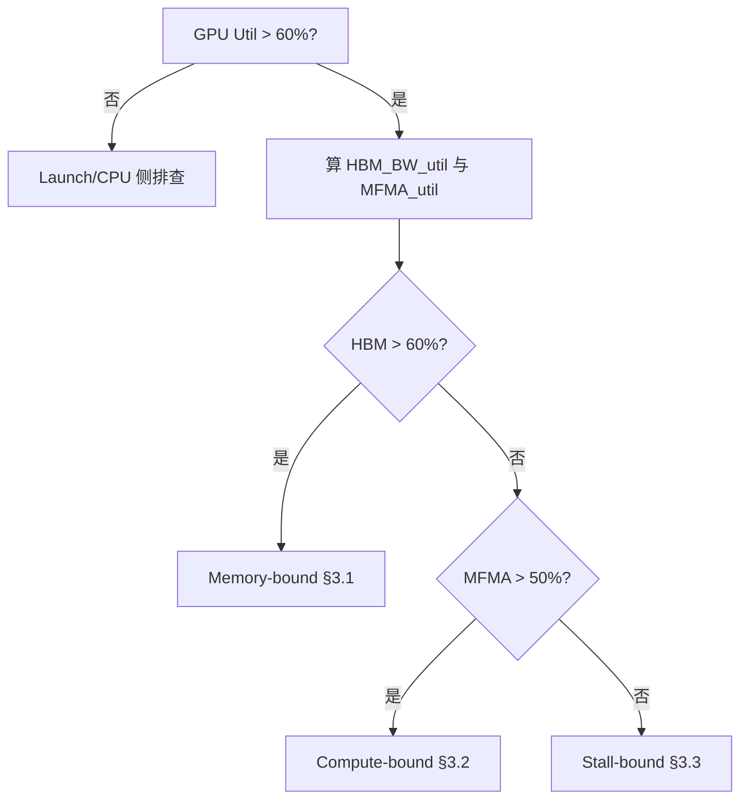

# AMD GPU Kernel 优化：Profiling → 行动决策树

> **用途**：供 AI agent 或工程师在拿到 **rocprof / rocprof-compute（原 Omniperf）/ 原始 PMC CSV** 后，按顺序执行分类、量化瓶颈、对照计数器、落地代码与调参。正文为中文，技术名词保持英文。  
> **前提**：已能针对**单个热点 kernel** 或 **rocprof-compute 某 dispatch** 拿到计数器；多 GCD / 多 XCD 场景需先按 **GCD / device** 聚合或分别判断。

---

## 0. 输入清单（开始决策树之前）

| 输入 | 来源 | 用途 |
|------|------|------|
| Kernel 名称、dispatch 时间窗 | trace / CSV | 对齐计数器区间 |
| `GRBM_*` / GPU active 比例 或 SoL 面板 **GPU Utilization** | rocprof-compute §2.1 / 系统 profiler | §1 快速分类 |
| HBM 相关 `TCC_EA_*`、时间 `duration_s` | PMC / CSV | §2 HBM BW utilization |
| `SQ_INSTS_VALU_MFMA_MOPS_*`、`SQ_BUSY_CYCLES`（或等价 busy） | PMC | §2 MFMA utilization |
| `TCC_HIT`、`TCC_MISS`、`TCP_*`、`SQ_*` | PMC | §3 分瓶颈细查 |

**知识库交叉阅读**（按主题）：

- 工具链与计数器列表：`rocprof-guide.md`、`omniperf-guide.md`（现为 **ROCm Compute Profiler / `rocprof-compute`**）
- MFMA 峰值、指令与数据布局：`crawl-data/p0_isa_mfma_lowlevel.md`
- 计数器公式与 MI300/350 差异：`crawl-data/rocm_crawl_report_round1.md`
- 进阶模式：`optimization-patterns.md`、`gemm-tuning-guide.md`、`isa/register-allocation.md`

---

## 1. 第一步：快速分类（Speed-of-Light）

**目标**：区分「GPU 是否在干活」与「kernel 是否值得优化」。

| 条件 | 结论 | 下一步 |
|------|------|--------|
| **GPU Utilization**（或等价：GPU active 时间占比）**> 60%** | **GPU-bound** — 继续 §2 | 进入内存 vs 计算分解 |
| **GPU Utilization < 30%** | **Launch overhead / CPU-bound / 调度问题** — **通常不是单个 compute kernel 微结构能解决的** | 查：grid 是否过小、stream 同步、`hipEvent` 屏障、host 侧数据准备、多进程抢占；必要时用 **ROCm Systems Profiler**（见 `rocprof-guide.md`）看 CPU–GPU 时间线 |
| **30%–60%** | **混合/不确定** | 同时看 §2 与 **trace 重叠度**（Perfetto）：若大量空洞 → 偏 launch；若持续满窗但指标低 → 偏微结构 |

**机械规则**：

1. 若 **SoL / System** 显示「整体引擎利用率持续极低」，**不要**先调 `__launch_bounds__`；先确认 **每次 kernel 有效工作量** 与 **launch 密度**（见 `omniperf-guide.md` 瓶颈决策树简版）。
2. 仅当 Utilization 明确偏高，才对 **HBM / MFMA / stall** 做 §2–§3。

---

## 2. 内存 vs 计算瓶颈判断

### 2.1 HBM 带宽利用率（Memory roof）

**公式（字节 → GB/s → 利用率）**：

$$
\text{HBM\_BW\_util} = \frac{(TCC\_EA\_RDREQ\_32B + TCC\_EA\_WRREQ\_32B) \times 32}{\text{time\_s} \times \text{peak\_HBM\_BW}}
$$

**实现注意**：

- 文档与驱动中常见 **`TCC_EA_RDREQ_DRAM_32B`**、**`TCC_EA_WRREQ_*`** 等变体；多 **TCC instance** 时需 **`_sum` 或逐实例相加**（见 `rocprof-guide.md` MI300/MI200 计数器说明）。
- **`time_s`** 必须与计数器采样区间一致（单 kernel 用该 dispatch 的 wall time 或 GPU active 窗口）。
- **`peak_HBM_BW`**：用 **datasheet / `rocm-smi` / 厂商白皮书** 的 **理论峰值**（如 MI300X 聚合约 **5.3 TB/s** 量级，见 `crawl-data/rocm_crawl_report_round1.md`）；多 GCD 时按 **单 GCD 有效峰值** 或 **聚合** 与测量方式一致。

**决策阈值（经验）**：

- **HBM_BW_util > 60%** → **memory-bound 强信号**（在确认非测量误差后）。
- **20%–60%** → 可能混合或受 **L2 / 合并度** 限制。
- **< 20%** 且 GPU busy → 倾向 **compute / stall / 低并发**。

### 2.2 MFMA 利用率（Compute / Matrix core）

**公式（按精度选用对应 MOPS 计数器）**：

$$
\text{MFMA\_util} = \frac{\sum \text{SQ\_INSTS\_VALU\_MFMA\_MOPS\_*}}{\text{SQ\_BUSY\_CYCLES} \times \text{peak\_MFMA\_MOPS\_per\_cycle}}
$$

其中 **`SQ_INSTS_VALU_MFMA_MOPS_*`** 文档常注明 **单位为 512 FLOP 的倍数**（见 `crawl-data/p0_isa_mfma_lowlevel.md` §9.2）。

**替代/校验（busy 比）**（见 `crawl-data/rocm_crawl_report_round1.md` §2.3）：

$$
\text{MFMA\_pipe\_busy\_ratio} \approx \frac{\text{SQ\_VALU\_MFMA\_BUSY\_CYCLES}}{\text{SQ\_BUSY\_CYCLES}}
$$

**决策阈值（经验）**：

- **MFMA_util > 50%**（或 **MFMA pipe busy ratio** 高）→ **compute-bound / MFMA-bound** 强信号。
- **MFMA 低 + VALU/VMEM 高** → 可能 **未走 MFMA** 或 **指令混合/依赖**。

### 2.3 三分法汇总

| 情形 | 判定 | 进入 |
|------|------|------|
| **HBM_BW_util > 60%** 且 MFMA 不更高优 | **Memory-bound** | §3.1 |
| **MFMA_util > 50%**（或 MFMA busy 主导）且 HBM 未顶满 | **Compute-bound** | §3.2 |
| **两者都低**（HBM 与 MFMA 均未触顶）且 GPU 仍 busy | **Stall-bound / 并发不足 / 指令依赖** | §3.3 |
| **两者都「看起来高」** | **需查是否双计数或时间窗不一致**；用 roofline / SoL 交叉验证 | 回到 §0 核对 `time_s` 与 counter 聚合 |



---

## 3. 每种瓶颈的诊断 + 行动表

### 3.1 Memory-bound

**核心计数器**（见 `rocprof-guide.md`、`crawl-data/p0_isa_mfma_lowlevel.md` §9）：

| 检查项 | 计数器 / 派生量 | 好 | 需关注 |
|--------|-----------------|----|--------|
| **L2 命中率** | \( \text{TCC\_HIT} / (\text{TCC\_HIT} + \text{TCC\_MISS}) \) | **> 80%** | 明显低于 80%：复用差或 working set 过大 |
| **合并 / vL1→L2 行为** | `TCP_TOTAL_CACHE_ACCESSES`、`TCP_TCC_READ_REQ`（对 L2 的请求） | 与算法预期一致 | 访问与「每 wave 预期事务数」数量级不符 → 合并差 |
| **L2 命中率（L1 视角，可选）** | \( (\text{TCP\_TOTAL\_CACHE\_ACCESSES} - \text{TCP\_TCC\_READ\_REQ}) / \text{TCP\_TOTAL\_CACHE\_ACCESSES} \)（见 `crawl-data/rocm_crawl_report_round1.md`） | 依 workload | 异常低 → vL1 抖动或 stride 差 |
| **LDS bank conflict** | `SQ_LDS_BANK_CONFLICT` / LDS 指令或周期 | **conflict 占比 < 5%**（占相关 stall 或 cycles 的比例） | **≥ 5%** 需改 LDS 布局 |
| **VMEM 延迟** | `SQ_ACCUM_PREV_HIRES / SQ_INSTS_VMEM` | 相对基线稳定 | 飙升 → 队列背压、合并、或 thrash |

**行动（按优先级）**：

1. **向量化全局加载**：`float4` / `half8` / 对齐指针；SoA、连续 thread → 连续地址（`crawl-data/rocm_crawl_report_round1.md` HIP 性能要点）。
2. **改善合并**：重排 thread→数据映射；避免随机 `A[idx[i]]` 热路径。
3. **LDS tiling**：块内复用，减少 HBM 往返；**padding** 避免 bank conflict（如 `data[32][33]` 模式，见同报告）。
4. **降低 L2 压力**：扩大 tile、提高数据复用；必要时减少同 CU 上活跃 wave 数以降低 thrash（权衡 occupancy）。

**代码级模式**：

- 用 **`__builtin_amdgcn_global_load_lds`** / async copy（若适用）把数据 pattern 固定为向量加载。
- GEMM：对齐 **rocWMMA / MFMA** 布局（`crawl-data/p0_isa_mfma_lowlevel.md` §2.5）。

**必读 KB**：`gemm-tuning-guide.md`、`isa/memory-instructions.md`、`optimization-patterns.md`。

---

### 3.2 Compute-bound

**核心计数器**：

| 检查项 | 计数器 | 好 | 需关注 |
|--------|--------|----|--------|
| **MFMA 按精度分解** | `SQ_INSTS_VALU_MFMA_MOPS_F16`、`..._BF16`、`..._F32`、`..._F64`、`..._I8`（CDNA4 另有 `..._F6F4`） | 与算法精度一致且 MOPS 高 | 目标精度 MOPS 极低 → 未用 Matrix Core |
| **VALU 吞吐** | `SQ_INSTS_VALU`、SoL §VALU FLOPs | GEMM 中 VALU 为辅助 | VALU 异常高、MFMA 低 → 编译器未映射 MFMA 或算法不适配 |
| **指令混合** | **`SQ_INSTS_VALU` vs `SQ_INSTS_MFMA`**（及 MOPS）；`SQ_INSTS_VMEM` | GEMM：**MFMA 指令条数与 MOPS 应主导**；VALU 为辅助 | **MFMA 低而 VALU 高** → 未用矩阵核或大量标量/向量收尾 |
| **MFMA 调度** | `SQ_VALU_MFMA_BUSY_CYCLES` | 高 | 低 → pipeline 空泡、依赖链、bad tile |

**行动**：

1. **能用 MFMA 则用 MFMA**：`__builtin_amdgcn_mfma_*` 或 rocWMMA（`crawl-data/p0_isa_mfma_lowlevel.md` §2–3）。
2. **提高 MFMA 有效吞吐**：调 tile（BLOCK_M/N/K）、K 维展开、双缓冲（见 `gemm-tuning-guide.md`、`ck-tile-tuning.md`）。
3. **混合精度**：FP16/BF16/FP8（CDNA3 **FNUZ** vs CDNA4 **OCP** 勿混，见 `crawl-data/rocm_crawl_report_round1.md` §2.2）。
4. **CDNA4**：评估 **FP6/FP4**、`SQ_INSTS_VALU_MFMA_F6F4` 是否可用（`crawl-data/rocm_crawl_report_round1.md` §1.8）。

**代码级模式**：

- 替换标量/向量手工 dot 为 **MFMA intrinsic**。
- 使用 **`amd_matrix_instruction_calculator`** 选对 **MxNxK**（`crawl-data/p0_isa_mfma_lowlevel.md` §1）。

**必读 KB**：`isa/mfma-instructions.md`、`hip-intrinsics.md`、`triton-rocm-quirks.md`（若用 Triton）。

---

### 3.3 Stall-bound（含低 occupancy、资源阻塞、依赖）

**核心计数器**（SPI / SQ，见 `crawl-data/p0_isa_mfma_lowlevel.md` §9.4–9.5）：

| 检查项 | 计数器 | 好 | 需关注 |
|--------|--------|----|--------|
| **寄存器溢出（Scratch）** | **ScratchWaves**（rocprof-compute Occupancy 报告）；或 **scratch memory** 字节数；`hipcc --resource-usage` | **0** / 无 spill | 非 0 → 优先减 live VGPR、拆 kernel |
| **VGPR 压力** | `SPI_RA_VGPR_SIMD_FULL_CSN`（文档亦见 `SPI_RA_VGPR_SIMD_FULL` 写法） | 低 | 高 → VGPR 限制 wave 数 |
| **LDS 压力** | `SPI_RA_LDS_CU_FULL_CSN` | 低 | 高 → 减 **动/静** 态 LDS 或 block 划分 |
| **Occupancy** | `SQ_LEVEL_WAVES` vs 架构 **max wave slots**（CDNA 每 SIMD 10 slots × pool，见 `crawl-data/p0_isa_mfma_lowlevel.md` §10） | 对 latency-bound kernel **足够隐藏延迟** | 过低且 stall 高 → 资源或划分问题 |
| **Barrier / wave 限制** | `SPI_RA_BAR_CU_FULL_CSN`、`SPI_RA_WVLIM_STALL_CSN` | 低 | 高 → 同步或 launch 配置 |
| **LDS bank / address** | `SQ_LDS_BANK_CONFLICT`、`SQ_LDS_ADDR_CONFLICT` | 低 | 高 → §3.1 布局 |

**行动**：

1. **减 VGPR**：减少 live range、融合变量、`__launch_bounds__` 提示编译器（`hipcc --resource-usage`，见 `crawl-data/rocm_crawl_report_round1.md`）。
2. **调 `__launch_bounds__(maxThreads, minBlocks)`**：在 spill 与 occupancy 间折中（`isa/register-allocation.md`）。
3. **用 AGPR（若适用）**：减轻 ACC 路径寄存器压力（ISA/编译器支持时，见 `crawl-data/p0_isa_mfma_lowlevel.md` §1 `--detail-instruction`）。
4. **LDS**：减每 block LDS、改 bank 友好访问；CDNA4 **64 banks** 与带宽变化见 §4。
5. **CDNA4 特供**：若见 `SQ_LDS_DATA_FIFO_FULL` / VMEM FIFO full，查 **MI350 新 stall 计数器**（`crawl-data/rocm_crawl_report_round1.md` §1.8）。

**必读 KB**：`isa/register-allocation.md`、`isa/scheduling-pipeline.md`、`common-mistakes.md`。

---

## 4. CDNA3 vs CDNA4 阈值与计数器差异表

| 维度 | CDNA3（例：gfx942 / MI300 系） | CDNA4（例：gfx950 / MI350 系） | 决策含义 |
|------|--------------------------------|--------------------------------|----------|
| **FP8 格式** | 默认 **FNUZ**（与 OCP 不兼容） | **OCP FP8**；新增 **FP6/FP4** | 迁移 kernel 时必须换类型与条件编译（`crawl-data/rocm_crawl_report_round1.md` §2.2） |
| **MFMA 计数** | 标准 `SQ_INSTS_VALU_MFMA_MOPS_*` | 新增 **`SQ_INSTS_VALU_MFMA_F6F4`**、**`..._MOPS_F6F4`** | 低精度路径 profiling 需看新列 |
| **VALU** | 单发为主 | **双发** `SQ_ACTIVE_INST_VALU2` | 高 VALU 吞吐时勿误判为「浪费」；对照峰值表 |
| **LDS** | **32 banks**，128 B/cycle 量级 | **64 banks**，**256 B/cycle** | 同一 **bank conflict 比例** 阈值可略放宽，但仍以 **< 5%** 为警戒；**stride/padding** 需按 64 banks 重评 |
| **LDS 细分计数** | 聚合 `SQ_INSTS_LDS` 等 | `SQ_INSTS_LDS_LOAD/STORE/...`、带宽类 | stall 分析更细，优先看 FIFO full 类 |
| **峰值 FLOPS 对比** | 例：MI325X Matrix FP16 **~1307 TF**（见 `crawl-data/p0_isa_mfma_lowlevel.md`） | MI355X Matrix FP16 **~2.5 PF** 量级 | **MFMA_util** 分母必须用 **对应 SKU 的 peak**，勿跨代混用 |
| **TF32 / FP32 matrix** | TF32 等路径在 CDNA3 文档常见 | 以 **MI350 文档**为准 | roofline 与 SoL 标题可能不同 |

**机械规则**：先 **`rocprof-compute` / `rocminfo` 判架构**，再选 **peak_HBM_BW** 与 **peak MFMA**，再算 §2 公式。

---

## 5. 常用 profiling 命令速查

### 5.1 ROCm Compute Profiler（`rocprof-compute`，原 Omniperf）

```bash
rocprof-compute profile -h
rocprof-compute profile --list-metrics
rocprof-compute profile --name WORKLOAD_NAME -- python your_script.py
rocprof-compute analyze -p WORKLOAD_NAME/MI300X --cli
```

- **`-k` / `-d` / `-b`**：按 kernel 子串、dispatch、报告块缩小范围（见 `omniperf-guide.md`）。
- **`--roof-only`**：仅 roofline 相关；默认 profile 常含 roofline 阶段（可用 **`--no-roof`** 跳过）。

### 5.2 rocprofv3（PMC / trace）

```bash
rocprofv3 --help
# 列出计数器（具体子命令以本机为准）
rocprofv3 --list-counters
```

- 输出 **CSV / JSON / PFTrace** → **Perfetto UI**（`https://ui.perfetto.dev`）看时间线（见 `rocprof-guide.md`）。
- **MI300/MI200 计数器名称**参考官方表与 `rocprof-guide.md` §MI300X。

### 5.3 系统级（CPU、驱动、多进程）

- **ROCm Systems Profiler**（原 Omnitrace 系）：与 `rocprofv3` 互补（`rocprof-guide.md` §关系）。

### 5.4 辅助

```bash
rocm-smi
rocminfo
hipcc --resource-usage your_kernel.hip   # 资源与 spill 线索
```

---

## 附录：agent 执行检查表（可逐条打勾）

1. [ ] 确认 **GPU Utilization** 是否支持继续 kernel 级优化（§1）。
2. [ ] 计算 **HBM_BW_util** 与 **MFMA_util**（§2），记录 `time_s` 与 counter 聚合方式。
3. [ ] 将结果映射到 **Memory / Compute / Stall** 之一（§2.3）。
4. [ ] 打开对应小节 **计数器表**，逐项过阈值（§3）。
5. [ ] 在 KB 中打开 **必读** 文档，应用 **代码模式**。
6. [ ] 核对 **CDNA3 vs CDNA4** 差异（§4）后复测。
7. [ ] 用 §5 命令保存 **前后对比** workload 目录。

---

## 参考链接（外部）

- [MI300 and MI200 performance counters and metrics](https://rocm.docs.amd.com/en/latest/conceptual/gpu-arch/mi300-mi200-performance-counters.html)
- [MI350 performance counters](https://rocm.docs.amd.com/en/latest/conceptual/gpu-arch/mi350-performance-counters.html)
- [Using rocprofv3](https://rocm.docs.amd.com/projects/rocprofiler-sdk/en/latest/how-to/using-rocprofv3.html)
- [ROCm Compute Profiler](https://rocm.docs.amd.com/projects/rocprofiler-compute/en/latest/index.html)
