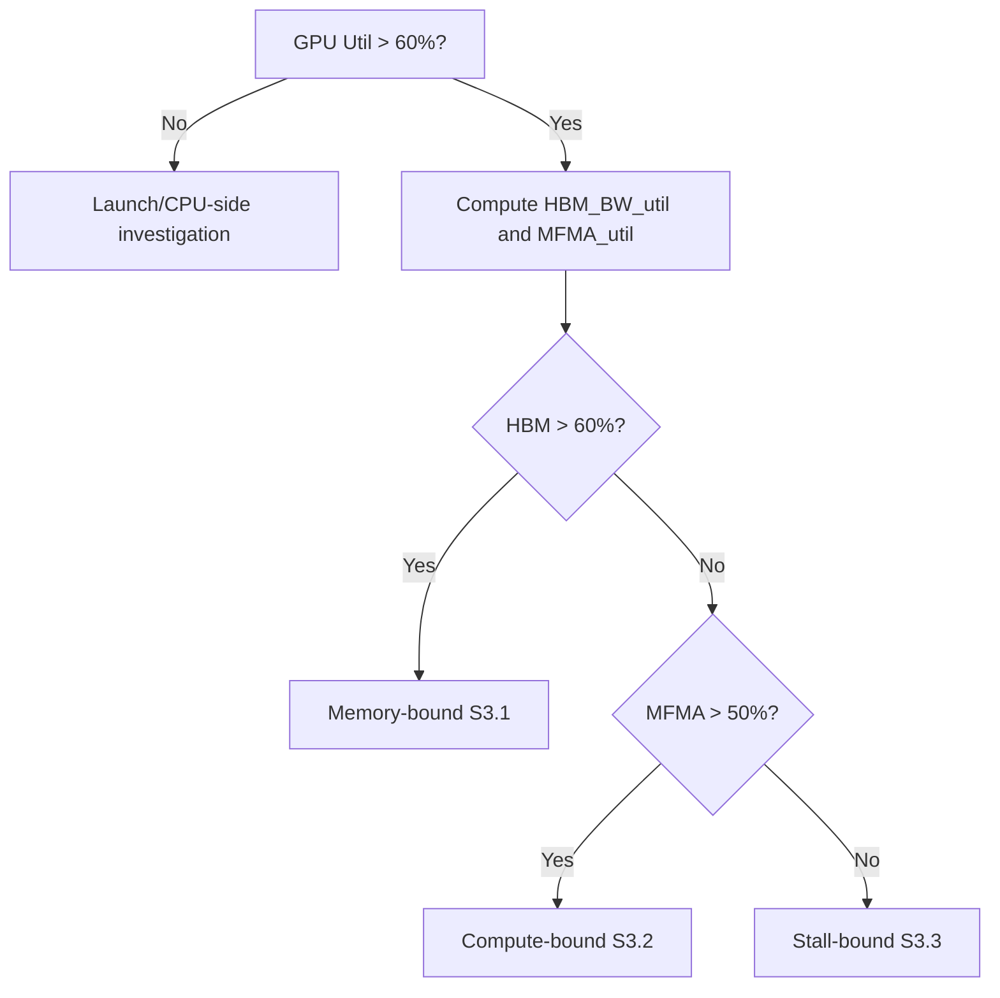

# AMD GPU Kernel Optimization: Profiling -> Action Decision Tree

> **Purpose**: For AI agents or engineers to follow after obtaining **rocprof / rocprof-compute (formerly Omniperf) / raw PMC CSV** data -- sequentially classify, quantify bottlenecks, cross-reference counters, and implement code changes and tuning. Body text is in English; technical terms remain in English.  
> **Prerequisites**: Already able to obtain counters for a **single hot kernel** or a **rocprof-compute dispatch**; multi-GCD / multi-XCD scenarios require aggregation or separate analysis by **GCD / device** first.

---

## 0. Input Checklist (before starting the decision tree)

| Input | Source | Purpose |
|-------|--------|---------|
| Kernel name, dispatch time window | trace / CSV | Align counter interval |
| `GRBM_*` / GPU active ratio or SoL panel **GPU Utilization** | rocprof-compute S2.1 / system profiler | S1 quick classification |
| HBM-related `TCC_EA_*`, time `duration_s` | PMC / CSV | S2 HBM BW utilization |
| `SQ_INSTS_VALU_MFMA_MOPS_*`, `SQ_BUSY_CYCLES` (or equivalent busy) | PMC | S2 MFMA utilization |
| `TCC_HIT`, `TCC_MISS`, `TCP_*`, `SQ_*` | PMC | S3 per-bottleneck deep dive |

**Knowledge base cross-reading** (by topic):

- Toolchain and counter lists: `rocprof-guide.md`, `omniperf-guide.md` (now **ROCm Compute Profiler / `rocprof-compute`**)
- MFMA peak, instructions, and data layout: `isa/mfma-instructions.md`
- Counter formulas and MI300/MI350 differences: `performance-counters.md`
- Advanced patterns: `optimization-patterns.md`, `gemm-tuning-guide.md`, `isa/register-allocation.md`

---

## 1. First Step: Quick Classification (Speed-of-Light)

**Goal**: Distinguish "whether the GPU is doing work" from "whether the kernel is worth optimizing."

| Condition | Conclusion | Next Step |
|-----------|------------|-----------|
| **GPU Utilization** (or equivalent: GPU active time ratio) **> 60%** | **GPU-bound** -- continue to S2 | Proceed to memory vs compute decomposition |
| **GPU Utilization < 30%** | **Launch overhead / CPU-bound / scheduling issue** -- **usually not solvable by single compute kernel microarchitecture tuning** | Check: is the grid too small, stream synchronization, `hipEvent` barriers, host-side data preparation, multi-process contention; if necessary use **ROCm Systems Profiler** (see `rocprof-guide.md`) to view CPU-GPU timeline |
| **30%-60%** | **Mixed/uncertain** | Check both S2 and **trace overlap** (Perfetto): if many gaps -> leaning toward launch issue; if continuously full window but metrics low -> leaning toward microarchitecture |

**Mechanical rules**:

1. If **SoL / System** shows "overall engine utilization is persistently very low," **do not** adjust `__launch_bounds__` first; first confirm **effective work per kernel launch** and **launch density** (see `omniperf-guide.md` simplified bottleneck decision tree).
2. Only when Utilization is clearly high should you perform S2-S3 analysis on **HBM / MFMA / stall**.

---

## 2. Memory vs Compute Bottleneck Determination

### 2.1 HBM Bandwidth Utilization (Memory roof)

**Formula (bytes -> GB/s -> utilization)**:

$$
\text{HBM\_BW\_util} = \frac{(TCC\_EA\_RDREQ\_32B + TCC\_EA\_WRREQ\_32B) \times 32}{\text{time\_s} \times \text{peak\_HBM\_BW}}
$$

**Implementation notes**:

- Documentation and drivers commonly show **`TCC_EA_RDREQ_DRAM_32B`**, **`TCC_EA_WRREQ_*`** and other variants; with multiple **TCC instances**, you need **`_sum` or per-instance summation** (see `rocprof-guide.md` MI300/MI200 counter documentation).
- **`time_s`** must be consistent with the counter sampling interval (for a single kernel, use that dispatch's wall time or GPU active window).
- **`peak_HBM_BW`**: Use the **theoretical peak** from **datasheet / `rocm-smi` / vendor whitepaper** (e.g., MI300X aggregate approximately **5.3 TB/s** range, see `hardware/mi300x.md`); for multi-GCD, match **per-GCD effective peak** or **aggregate** with the measurement approach.

**Decision thresholds (empirical)**:

- **HBM_BW_util > 60%** -> **memory-bound strong signal** (after confirming no measurement error).
- **20%-60%** -> Possibly mixed or limited by **L2 / coalescing**.
- **< 20%** with GPU busy -> Leaning toward **compute / stall / low concurrency**.

### 2.2 MFMA Utilization (Compute / Matrix core)

**Formula (select the corresponding MOPS counter by precision)**:

$$
\text{MFMA\_util} = \frac{\sum \text{SQ\_INSTS\_VALU\_MFMA\_MOPS\_*}}{\text{SQ\_BUSY\_CYCLES} \times \text{peak\_MFMA\_MOPS\_per\_cycle}}
$$

Where **`SQ_INSTS_VALU_MFMA_MOPS_*`** is commonly documented as being **in units of multiples of 512 FLOPs** (see `performance-counters.md`).

**Alternative/verification (busy ratio)** (see `performance-counters.md`):

$$
\text{MFMA\_pipe\_busy\_ratio} \approx \frac{\text{SQ\_VALU\_MFMA\_BUSY\_CYCLES}}{\text{SQ\_BUSY\_CYCLES}}
$$

**Decision thresholds (empirical)**:

- **MFMA_util > 50%** (or **MFMA pipe busy ratio** high) -> **compute-bound / MFMA-bound** strong signal.
- **MFMA low + VALU/VMEM high** -> Possibly **not going through MFMA** or **instruction mix/dependency** issues.

### 2.3 Three-way Classification Summary

| Scenario | Determination | Proceed to |
|----------|---------------|------------|
| **HBM_BW_util > 60%** and MFMA is not higher priority | **Memory-bound** | S3.1 |
| **MFMA_util > 50%** (or MFMA busy dominant) and HBM not saturated | **Compute-bound** | S3.2 |
| **Both low** (HBM and MFMA both not hitting ceiling) but GPU still busy | **Stall-bound / insufficient concurrency / instruction dependency** | S3.3 |
| **Both "appear high"** | **Need to check for double-counting or time window inconsistency**; cross-verify with roofline / SoL | Return to S0 to verify `time_s` and counter aggregation |



---

## 3. Diagnosis + Action Table for Each Bottleneck Type

### 3.1 Memory-bound

**Core counters** (see `rocprof-guide.md`, `performance-counters.md`):

| Check Item | Counter / Derived Metric | Good | Needs Attention |
|------------|--------------------------|------|-----------------|
| **L2 hit rate** | \( \text{TCC\_HIT} / (\text{TCC\_HIT} + \text{TCC\_MISS}) \) | **> 80%** | Significantly below 80%: poor reuse or working set too large |
| **Coalescing / vL1->L2 behavior** | `TCP_TOTAL_CACHE_ACCESSES`, `TCP_TCC_READ_REQ` (requests to L2) | Consistent with algorithmic expectation | Access count differs by orders of magnitude from "expected transactions per wave" -> poor coalescing |
| **L2 hit rate (from L1 perspective, optional)** | \( (\text{TCP\_TOTAL\_CACHE\_ACCESSES} - \text{TCP\_TCC\_READ\_REQ}) / \text{TCP\_TOTAL\_CACHE\_ACCESSES} \) (see `performance-counters.md`) | Depends on workload | Abnormally low -> vL1 thrashing or poor stride |
| **LDS bank conflict** | `SQ_LDS_BANK_CONFLICT` / LDS instructions or cycles | **conflict ratio < 5%** (as proportion of related stalls or cycles) | **>= 5%** requires LDS layout change |
| **VMEM latency** | `SQ_ACCUM_PREV_HIRES / SQ_INSTS_VMEM` | Stable relative to baseline | Spike -> queue backpressure, coalescing, or thrashing |

**Actions (by priority)**:

1. **Vectorize global loads**: `float4` / `half8` / aligned pointers; SoA, contiguous threads -> contiguous addresses (`system-tuning.md` HIP performance essentials).
2. **Improve coalescing**: Rearrange thread->data mapping; avoid random `A[idx[i]]` on hot paths.
3. **LDS tiling**: Intra-block reuse, reduce HBM round-trips; **padding** to avoid bank conflicts (e.g., `data[32][33]` pattern, see same report).
4. **Reduce L2 pressure**: Increase tile size, improve data reuse; if necessary reduce active waves per CU to reduce thrashing (trade off against occupancy).

**Code-level patterns**:

- Use **`__builtin_amdgcn_global_load_lds`** / async copy (if applicable) to lock data patterns into vector loads.
- GEMM: Align with **rocWMMA / MFMA** layout (`isa/mfma-instructions.md`).

**Required KB reading**: `gemm-tuning-guide.md`, `isa/memory-instructions.md`, `optimization-patterns.md`.

---

### 3.2 Compute-bound

**Core counters**:

| Check Item | Counter | Good | Needs Attention |
|------------|---------|------|-----------------|
| **MFMA by precision breakdown** | `SQ_INSTS_VALU_MFMA_MOPS_F16`, `..._BF16`, `..._F32`, `..._F64`, `..._I8` (CDNA4 additionally has `..._F6F4`) | Consistent with algorithm precision and MOPS is high | Target precision MOPS extremely low -> not using Matrix Core |
| **VALU throughput** | `SQ_INSTS_VALU`, SoL S-VALU FLOPs | In GEMM, VALU should be auxiliary | VALU abnormally high, MFMA low -> compiler not mapping to MFMA or algorithm not suitable |
| **Instruction mix** | **`SQ_INSTS_VALU` vs `SQ_INSTS_MFMA`** (and MOPS); `SQ_INSTS_VMEM` | GEMM: **MFMA instruction count and MOPS should dominate**; VALU is auxiliary | **MFMA low while VALU high** -> not using matrix cores or excessive scalar/vector epilogue |
| **MFMA scheduling** | `SQ_VALU_MFMA_BUSY_CYCLES` | High | Low -> pipeline bubbles, dependency chains, bad tile |

**Actions**:

1. **Use MFMA whenever possible**: `__builtin_amdgcn_mfma_*` or rocWMMA (`isa/mfma-instructions.md`, `libraries/rocwmma-reference.md`).
2. **Increase MFMA effective throughput**: Tune tiles (BLOCK_M/N/K), K-dimension unrolling, double buffering (see `gemm-tuning-guide.md`, `ck-tile-tuning.md`).
3. **Mixed precision**: FP16/BF16/FP8 (CDNA3 **FNUZ** vs CDNA4 **OCP** must not be mixed, see `isa/mfma-instructions.md` FP8 section).
4. **CDNA4**: Evaluate whether **FP6/FP4**, `SQ_INSTS_VALU_MFMA_F6F4` are available (`hardware/mi355x.md`, `performance-counters.md`).

**Code-level patterns**:

- Replace scalar/vector manual dot products with **MFMA intrinsics**.
- Use **`amd_matrix_instruction_calculator`** to select the right **MxNxK** (`isa/mfma-instructions.md`).

**Required KB reading**: `isa/mfma-instructions.md`, `hip-intrinsics.md`, `triton-rocm-quirks.md` (if using Triton).

---

### 3.3 Stall-bound (including low occupancy, resource blocking, dependencies)

**Core counters** (SPI / SQ, see `performance-counters.md`):

| Check Item | Counter | Good | Needs Attention |
|------------|---------|------|-----------------|
| **Register spill (Scratch)** | **ScratchWaves** (rocprof-compute Occupancy report); or **scratch memory** byte count; `hipcc --resource-usage` | **0** / no spill | Non-zero -> prioritize reducing live VGPRs, split kernel |
| **VGPR pressure** | `SPI_RA_VGPR_SIMD_FULL_CSN` (also documented as `SPI_RA_VGPR_SIMD_FULL`) | Low | High -> VGPRs limiting wave count |
| **LDS pressure** | `SPI_RA_LDS_CU_FULL_CSN` | Low | High -> reduce **dynamic/static** LDS or block partitioning |
| **Occupancy** | `SQ_LEVEL_WAVES` vs architecture **max wave slots** (CDNA: 10 slots per SIMD x pool, see `isa/register-allocation.md`) | For latency-bound kernels, **sufficient to hide latency** | Too low and stalls high -> resource or partitioning issue |
| **Barrier / wave limit** | `SPI_RA_BAR_CU_FULL_CSN`, `SPI_RA_WVLIM_STALL_CSN` | Low | High -> synchronization or launch configuration |
| **LDS bank / address** | `SQ_LDS_BANK_CONFLICT`, `SQ_LDS_ADDR_CONFLICT` | Low | High -> S3.1 layout |

**Actions**:

1. **Reduce VGPRs**: Reduce live range, merge variables, use `__launch_bounds__` to hint the compiler (`hipcc --resource-usage`, see `system-tuning.md`).
2. **Tune `__launch_bounds__(maxThreads, minBlocks)`**: Trade off between spill and occupancy (`isa/register-allocation.md`).
3. **Use AGPRs (if applicable)**: Relieve ACC path register pressure (when ISA/compiler support is available, see `isa/mfma-instructions.md`).
4. **LDS**: Reduce per-block LDS, adopt bank-friendly access patterns; CDNA4 **64 banks** and bandwidth changes see S4.
5. **CDNA4 specific**: If seeing `SQ_LDS_DATA_FIFO_FULL` / VMEM FIFO full, check **MI350 new stall counters** (`hardware/mi355x.md`, `performance-counters.md`).

**Required KB reading**: `isa/register-allocation.md`, `isa/scheduling-pipeline.md`, `common-mistakes.md`.

---

## 4. CDNA3 vs CDNA4 Thresholds and Counter Differences Table

| Dimension | CDNA3 (e.g., gfx942 / MI300 series) | CDNA4 (e.g., gfx950 / MI350 series) | Decision Implication |
|-----------|--------------------------------------|--------------------------------------|----------------------|
| **FP8 format** | Default **FNUZ** (incompatible with OCP) | **OCP FP8**; new **FP6/FP4** added | Must switch types and use conditional compilation when migrating kernels (`isa/mfma-instructions.md` FP8 section) |
| **MFMA counters** | Standard `SQ_INSTS_VALU_MFMA_MOPS_*` | New **`SQ_INSTS_VALU_MFMA_F6F4`**, **`..._MOPS_F6F4`** added | Low-precision path profiling requires checking new columns |
| **VALU** | Primarily single-issue | **Dual-issue** `SQ_ACTIVE_INST_VALU2` | Do not misjudge high VALU throughput as "waste" when it is high; compare against peak table |
| **LDS** | **32 banks**, ~128 B/cycle | **64 banks**, **256 B/cycle** | Same **bank conflict ratio** threshold can be slightly relaxed, but still use **< 5%** as alert level; **stride/padding** needs re-evaluation for 64 banks |
| **LDS granular counters** | Aggregated `SQ_INSTS_LDS` etc. | `SQ_INSTS_LDS_LOAD/STORE/...`, bandwidth-class | Stall analysis is more granular, prioritize FIFO full type counters |
| **Peak FLOPS comparison** | E.g., MI325X Matrix FP16 **~1307 TF** (see `isa/mfma-instructions.md`) | MI355X Matrix FP16 **~2.5 PF** range | **MFMA_util** denominator must use **the corresponding SKU's peak**, do not mix across generations |
| **TF32 / FP32 matrix** | TF32 and related paths commonly seen in CDNA3 docs | Refer to **MI350 documentation** | Roofline and SoL titles may differ |

**Mechanical rule**: First **`rocprof-compute` / `rocminfo` to determine architecture**, then select **peak_HBM_BW** and **peak MFMA**, then compute S2 formulas.

---

## 5. Common Profiling Command Quick Reference

### 5.1 ROCm Compute Profiler (`rocprof-compute`, formerly Omniperf)

```bash
rocprof-compute profile -h
rocprof-compute profile --list-metrics
rocprof-compute profile --name WORKLOAD_NAME -- python your_script.py
rocprof-compute analyze -p WORKLOAD_NAME/MI300X --cli
```

- **`-k` / `-d` / `-b`**: Narrow scope by kernel substring, dispatch, or report block (see `omniperf-guide.md`).
- **`--roof-only`**: Roofline-related only; default profile often includes a roofline phase (use **`--no-roof`** to skip).

### 5.2 rocprofv3 (PMC / trace)

```bash
rocprofv3 --help
# List counters (exact subcommand depends on local installation)
rocprofv3 --list-counters
```

- Output **CSV / JSON / PFTrace** -> **Perfetto UI** (`https://ui.perfetto.dev`) for timeline viewing (see `rocprof-guide.md`).
- **MI300/MI200 counter names** refer to official tables and `rocprof-guide.md` S-MI300X.

### 5.3 System-level (CPU, driver, multi-process)

- **ROCm Systems Profiler** (formerly Omnitrace family): Complements `rocprofv3` (`rocprof-guide.md` S-Relationship).

### 5.4 Auxiliary

```bash
rocm-smi
rocminfo
hipcc --resource-usage your_kernel.hip   # Resource and spill clues
```

---

## Appendix: Agent Execution Checklist (check off each item)

1. [ ] Confirm whether **GPU Utilization** supports continuing kernel-level optimization (S1).
2. [ ] Compute **HBM_BW_util** and **MFMA_util** (S2), record `time_s` and counter aggregation method.
3. [ ] Map results to one of **Memory / Compute / Stall** (S2.3).
4. [ ] Open the corresponding subsection **counter table**, check each item against thresholds (S3).
5. [ ] Open the **required reading** documents in the KB, apply **code patterns**.
6. [ ] Verify **CDNA3 vs CDNA4** differences (S4) then re-measure.
7. [ ] Use S5 commands to save **before/after comparison** workload directories.

---

## External Reference Links

- [MI300 and MI200 performance counters and metrics](https://rocm.docs.amd.com/en/latest/conceptual/gpu-arch/mi300-mi200-performance-counters.html)
- [MI350 performance counters](https://rocm.docs.amd.com/en/latest/conceptual/gpu-arch/mi350-performance-counters.html)
- [Using rocprofv3](https://rocm.docs.amd.com/projects/rocprofiler-sdk/en/latest/how-to/using-rocprofv3.html)
- [ROCm Compute Profiler](https://rocm.docs.amd.com/projects/rocprofiler-compute/en/latest/index.html)
